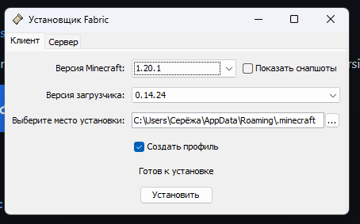
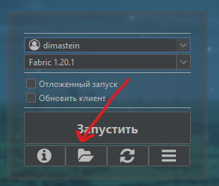

# Как устанавливать моды?

Здесь мы кратко расскажем как скачивать моды на разные лаунчеры.

!!! tip ""
    Мод это файлик с припиской `.jar` на конце.

## **TLauncher/Klauncher**

1. Удаляешь этот лаунчер
    - У них крайне плохая репутация, они известны воровством данных, поломкой скинов и просто убогой оптимизацией

2. Скачиваешь Legacy Launcher/Luna Launcher/покупаешь лицензию

3. Переходишь на другие гайды

## **Официальный Майнкрафт Лаунчер**

1. Переходишь на [https://fabricmc.net/](https://fabricmc.net/) и кликаешь огромную синую кнопку `download here

2. Запускаешь скачанный файлик. В нём выбираешь свою версию и правильный путь установки (туда, где находится майнкрафт, обычно он находится в `C:\Users\ТвоёИмя(антон)\AppData\Roaming\minecraft`) 

3. Перезагружаешь лаунчер, в версиях замечаешь новый пункт с названием примерно `fabric-mc-1.228.1337`

4. Переходишь в папку, создаёшь в ней папку с названием `mods` (или просто запускаешь Майнкрафт и закрываешь)

5. Перекидываешь нужные моды в эту папку `mods`

6. Запускаешь игру и радуешься жизни!

## **Legacy Launcher**

1. Выбираешь в версиях `Fabric <текущая версия сервера>`

2. Нажимаешь на кнопку папки в лаунчере

3. В открывшиеся папке создаёшь папку `mods`, если таковой нет

4. Скачиваешь моды и перекидываешь их туда

