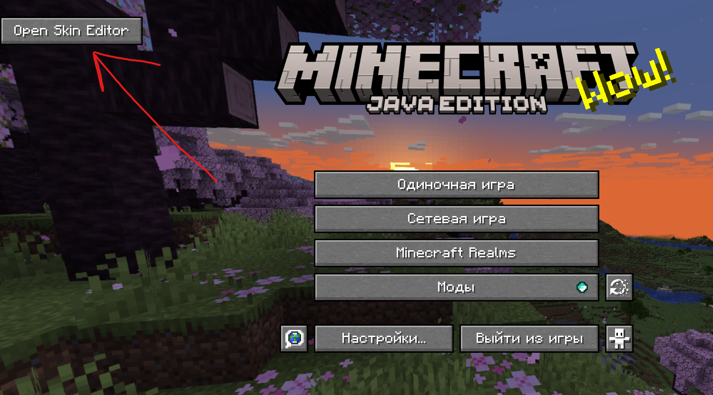
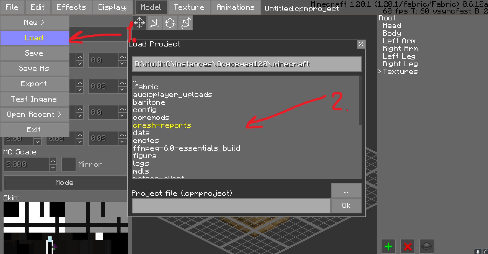
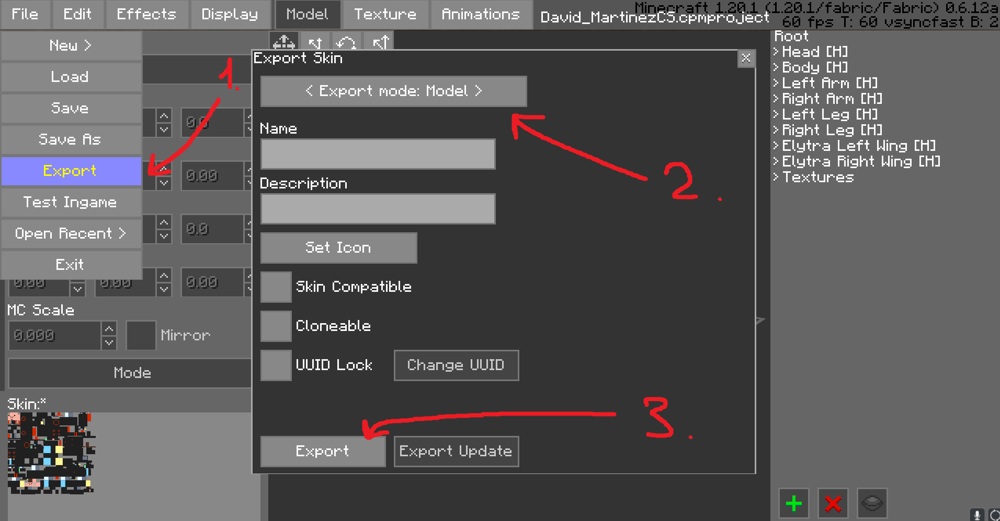

# Как установить/создать свою модель CPM?

## Установка готовой модели

В Дискорде мода есть канал с готовыми модельками, можешь взять что-то от туда: [https://discord.gg/7nmPAFZRPB](https://discord.gg/7nmPAFZRPB)

Скорее всего ты скачаешь модель .cpmproject. Это файл проекта, но не модельки. Для создания модельки из проекта, тебе нужно:

1. Перекинуть этот файлик в любую папку внутри майнкрафта (или любую другую, но в папке майнкрафта будет удобнее)

2. Зайти в внутриигровой режим создания скина

3. Нажать **File -> Load** и выбрать файл проекта в той папке, куда ты её засунул(а)

4. Загрузится моделька. Далее нужно нажать **File -> Export -> Выбрать сверху "Export mode: Model"** и нажать ++enter++

5. Всё! Моделька эскпортирована и готова к использованию!

## Создание своей модели

Пока что я не знаю, как создавать свои модели. Потыкайся в внутриигровом редакторе или зайди на [официальную вики мода](https://github.com/tom5454/CustomPlayerModels/wiki)!