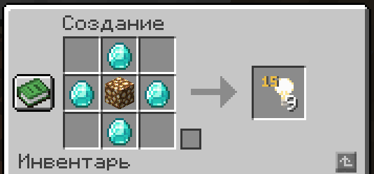
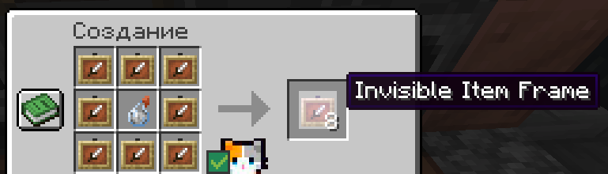
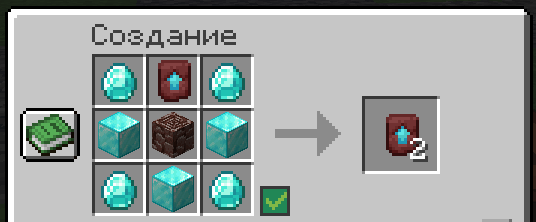
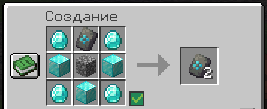
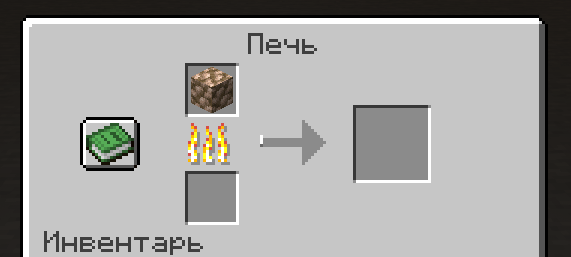

<!-- Yandex.RTB R-A-5374421-1 -->

# Кастомные крафты

??? tip "9 блоков невидимого света"
    { align=right width=350}

    Очень полезная в строительстве вещь! Позволяет ставить невидимый свет и даже регулировать яркость!

??? tip "Невидимая рамка"
    { align=right width=450}

    Позволяет ставить невидимую рамку!

    Хотя можно воспользоваться командой `/itemframe`

??? tip "Новые крафты шаблонов"

    Для баланса, повышения ценности и замедлении геймплея, крафт шаблонов был усложнён!

    В обычных шаблонах теперь нужно **3 алмазных блока**, а в улучшении незерита - **древний обломок**!

    { align=right width=350}
    { align=right width=350}

??? tip "Рудный блок"

    { align=right width=350}

    Блоки руды можно сразу переплавлять в печке в 9 слитков!