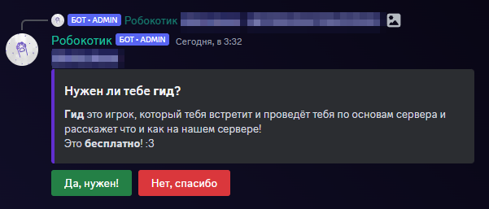

# Гайд для новичков
Твою заявку приняли! Поздравляю! Теперь парочка вещей:

- Если ты писал(а) заявку через Дискорд - **крайне** советуем взять Гида! Это можно сделать даже если ты отклонил(а) запрос! Гид расскажет тебе о нашем сервере, проведёт по спавну и расскажет что и куда делать! 

- Глянь хотя бы одним глазком наши [правила](../Информация/Правила/rules.md) и [законы](../Информация/Правила/laws.md) - так ты не угодишь в бан или тюрьму при первой возможности

- Установи сборку нашего сервера или обязательные моды - это важно! Тебя никто не обязывает говорить в войсчат, но слушать же никак не помешает, верно?

    - [Моды для сервера](./Моды/required_mods.md) или [готовая сборка](./Моды/mods.md)

    - Не умеешь скачивать моды? Не проблема! Мы [написали гайд](../Гайды/mod_download.md) только для тебя!

# Таак, а дальше чо?
Заходи по нашему IP и играй! Тебе доступен опыт Ванилла+ РП сервера!

- Построй свой город и набери кучу людей

- Начни проходить 1000+ достижений

- Проходи ежедневки у Бармена

- Попробуй выполнить весь [**CatPass**](../Геймплей/Награды/catpass.md)

- Вари алкоголь, лови рыбу через мини-игры, рисуй картины через плагин

- Вступи в КСБ, в правительство или ОПГ

- Учавствуй в строительстве огромных проектов

- Создавай дикие РП ивенты, ведь администрация может сделать *почти* любую фишку для этого!

- Или что-угодно - это же Майнкрафт!