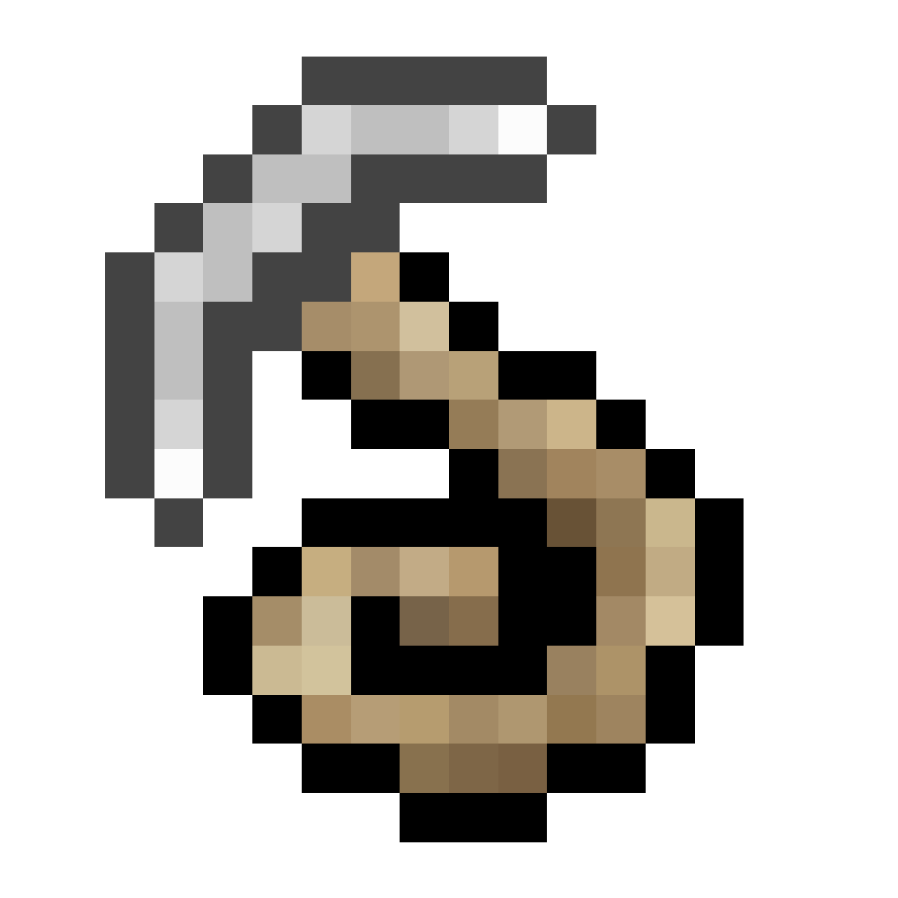

# Крюк-кошка

!!! tip inline end "Предмет"
    <figure markdown="span">
        { width=150 }
    </figure>
    ***
    **Название:** Крюк-кошка
    ***
    **Тип:** Предмет
    ***
    **Получение:**
    
    - ???
    ***
    **Текстура by:** ТОЧНО НЕ СПИЗЖЕНА С МОДА НА 1.7.10
    ***
    **Идея by:** Всекотец

**Крюк-кошка** - предмет, позволяющий цеплятся за блоки и "прыгать" к ним!

На данный момент официально не добавлено на сервер.

***